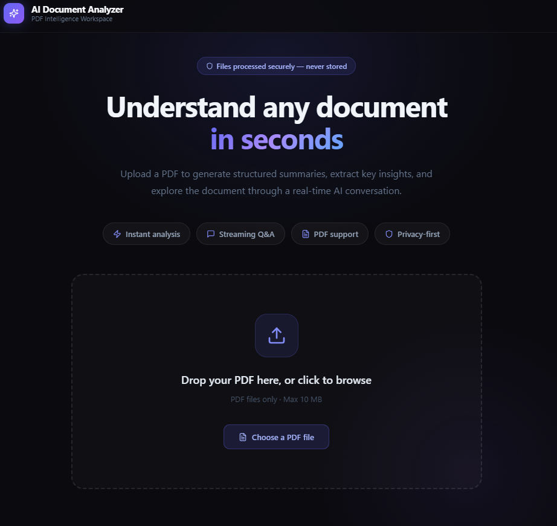
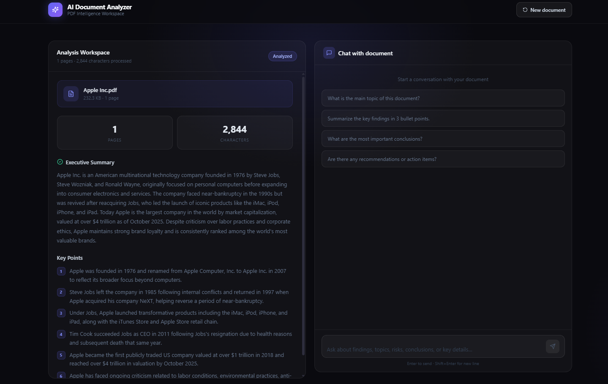

# AI Document Analyzer

Production-oriented AI systems project for PDF understanding, structured summarization, and streaming question answering.

AI Document Analyzer is a full-stack application that lets users upload a PDF, extract text server-side, generate a structured summary, and ask follow-up questions through a streaming chat interface. The current architecture is optimized for single-document analysis and is intentionally structured to evolve into a retrieval-based RAG system for larger files and multi-document workflows.

## Why this project matters

This is not positioned as a simple chatbot demo. It is an AI application systems project that demonstrates:
- secure server-side LLM integration
- document ingestion and parsing
- typed API boundaries and request validation
- real-time streaming responses
- production-minded handling of prompt injection risk, file validation, and deployment concerns
  
  ## Demo





## Core capabilities

- PDF upload with drag-and-drop UX
- server-side text extraction with pdf-parse
- structured document summary generation
- streaming document Q and A over extracted context
- multi-turn chat history support
- strict environment validation for secrets
- safer PDF validation including signature checks
- CI workflow for type checking and build verification
- Docker support for containerized deployment

## Tech stack

- Next.js 14 App Router
- TypeScript
- Anthropic SDK
- pdf-parse
- Tailwind CSS
- React Dropzone
- Vercel or Docker deployment

## System architecture

1. Client uploads a PDF from the browser.
2. The server validates file size, extension, MIME type, and PDF signature.
3. The PDF is parsed in a Node.js runtime using pdf-parse.
4. Extracted text is normalized and truncated for bounded context usage.
5. The analyze route generates a structured summary and key points.
6. The chat route streams token output back to the client for follow-up questions.
7. Recent conversation turns are included to preserve local chat context.

## Production improvements included in this version

- hardened system prompt to treat PDF text as untrusted input
- safer JSON parsing for structured LLM output
- centralized config values for file and context limits
- explicit environment variable validation
- structured API error payloads
- improved chat state handling to avoid stale-history issues
- document text truncation to reduce cost and latency
- GitHub Actions workflow for CI
- Dockerfile for container deployment

## Remaining roadmap items

These are the next production steps for a fully scalable release:
- retrieval-based chunking and vector search for large PDFs
- rate limiting
- authentication and per-user usage limits
- persistent chat history and document storage metadata
- observability with Sentry or Datadog
- API and component tests
- OCR fallback for scanned PDFs

## Local development

```bash
git clone https://github.com/your-username/ai-document-analyzer.git
cd ai-document-analyzer
npm install
cp .env.local.example .env.local
npm run dev
```

Open `http://localhost:3000`.

## Environment variables

Create `.env.local` with:

```bash
ANTHROPIC_API_KEY=your_key_here
NEXT_PUBLIC_APP_URL=http://localhost:3000
MAX_FILE_SIZE_MB=10
ANALYZE_CONTEXT_CHARS=150000
CHAT_CONTEXT_CHARS=100000
MAX_HISTORY_MESSAGES=10
ANALYSIS_TEXT_RETURN_CHARS=100000
```

## Scripts

```bash
npm run dev
npm run build
npm run start
npm run type-check
npm run test
```

## Deploying

### Vercel
- import the repository
- add `ANTHROPIC_API_KEY` as an environment variable
- deploy

### Docker

```bash
docker build -t ai-document-analyzer .
docker run -p 3000:3000 --env ANTHROPIC_API_KEY=your_key_here ai-document-analyzer
```

## How to present this on GitHub and LinkedIn

Recommended positioning:

AI Document Analyzer is a production-oriented AI systems project that ingests PDFs, generates structured summaries, and supports streaming contextual Q and A through a secure full-stack architecture.

Suggested repository subtitle:

Production-oriented AI document analyzer built with Next.js, TypeScript, Anthropic, PDF parsing, and streaming chat.

## License

MIT
